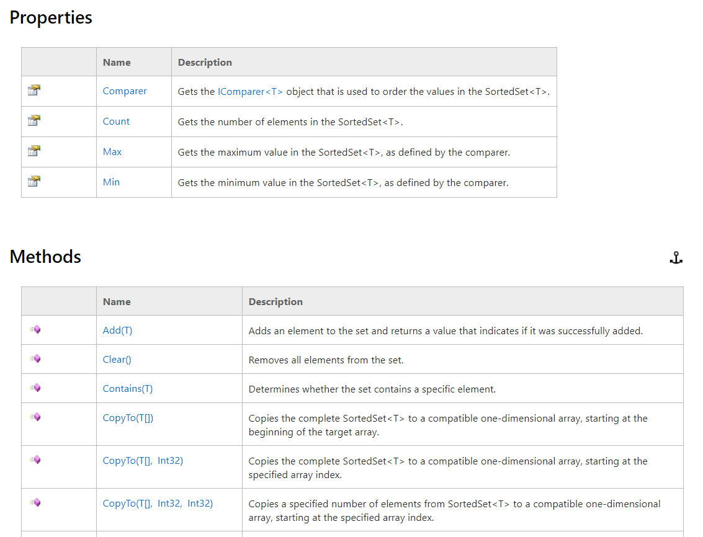
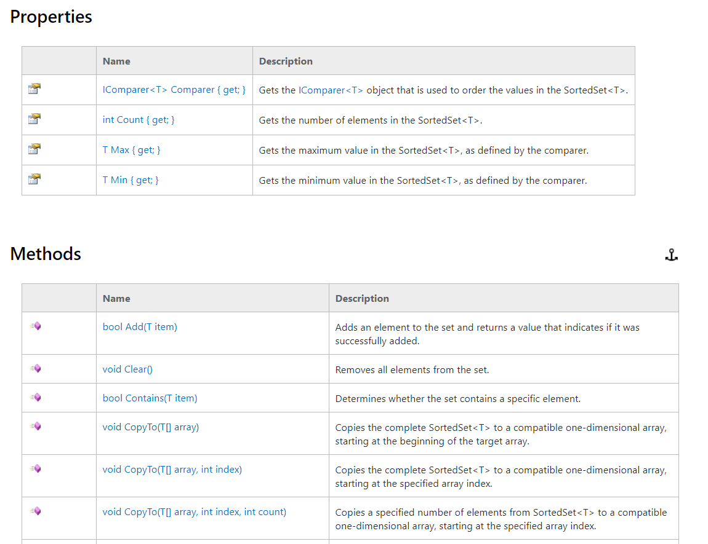

# NET-Framework-documentation-signatures
A [Tampermonkey](https://tampermonkey.net) script augmenting [.NET Framework documentation](https://msdn.microsoft.com/en-us/library/mt472912(v=vs.110).aspx). On any page describing a class, struct or interface the script updates the *Name* column in *Constructors*, *Properties* and *Methods* tables to contain the full signature of a member. For method it adds return type and names of parameters, for constructor - names of parameters, and for property - type of property and information whether it is getter and setter.

The following pictures show documentation of [SortedSet&lt;T&gt;](https://msdn.microsoft.com/en-us/library/dd412070(v=vs.110).aspx) class - original and after script run. The new content is simply taken from the detail page of a class/struct/interface member.

**Original documentation:**

**Documentation changed by the script:**

Tested in Google Chrome 64.0 on Windows 10.
